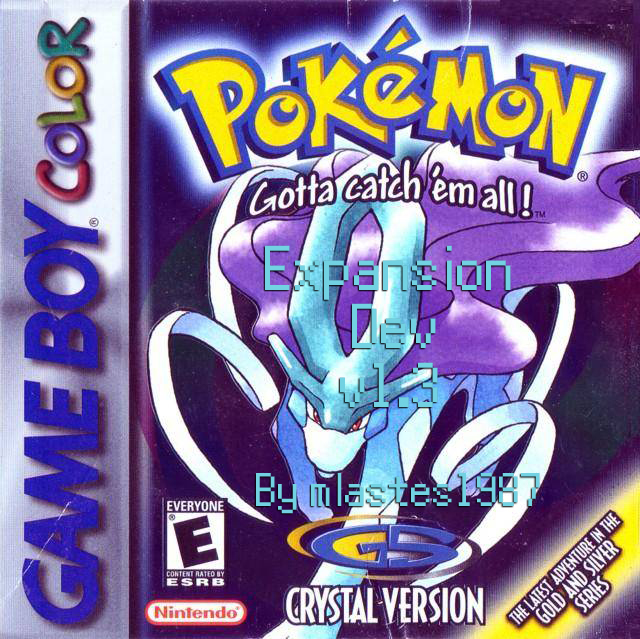

# Crystal Expansion Dev

Based on the pokecrystal disassembly by [**Pret**](https://github.com/pret/pokecrystal)

# Features

- **Tradeback NPC** A Tradeback Red NPC stands in the back of Elm's Lab for you to trade all trade evolutions with.

- **Pocket PC** After receiving your starter Pokemon, one of Elm's Aides near the entrance will hand you a Pocket PC key item after your Potion to allow you to access the PC anywhere outside of your house and Pokemon Center.

- **Gen. 6 Exp. Share Key Item** After coming back from Mr. Pokemon and one of the other starters are stolen by Silver, Elm's Aide will hand you the Exp. Share key item with your Poke Balls which distributes EXP points to your whole party in battle and during catches.  You can toggle on and off in the Key Items bag.

- **Earn EXP by catching mons**

- **Party Menu Color Icons** Icons for every Pokemon will be in your party menu instead of the vanilla ones, in color.

- **Different color pallate for Johto Badges**

- **3rd Page in Trainer Card for Kanto Leaders/Badges**

- **Running Shoes** Hold B while walking to run.

- **Show names of TMs when receiving/buying**

- **Kurt makes Pokeballs Instantly** Instead of waiting until the next day, Pokeballs are made instantly.  Unsure if this will work with the GS Ball Event.

- **Restored Celebi GS Ball Event** After defeating the Elite Four and becoming Champion, fly to the Goldenrod City Pokemon Center, a nurse aide will give you the GS Ball item, fly to Ecruteak and give it to Kurt, the next day he'll say that the forest is behaving strangely.  Go to Azalea Forest and put the GS Ball in the shrine past the cut tree.  An animation will occur and you get to fight/catch a lvl 70 Celebi.

- **Rare Candies, Master Balls and Evolution Stones** All marts with the exception of the fake mart in Mahogany before you beat Team Rocket, Mt. Moon and the Underground Path sell Rare Candies and Masterball for 0 Pokedollars.  The 3rd floor of the Goldenrod City Department Store has a clerk that sells all Evolution stones.

- **Known Issues** Any known or reported issues will be put here until they are resolved.

# Credits/Thanks

Thank you to the [**pret**](https://pret.github.io) community whose repository and code tutorials made this possible.

Thank you also to the minidex team and [**fellowship-of-the-roms**](https://github.com/fellowship-of-the-roms/CrystalShireEngine) for the party menu icons.
