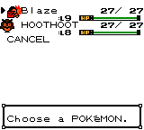

# Crystal Expansion Dev

Based on the pokecrystal disassembly by [**Pret**](https://github.com/pret/pokecrystal)

# Features

- **Tradeback NPC** In the back of Elm's Lab stands a Red NPC to trade back all trade evolutions.

- **Pocket PC** After receiving your starter, Elm's Aide will give you a Pocket PC Key Item with your Potion that will allow you to access your PC outside of your house and the Pokemon Center.

- **Gen 6. Exp. Share Key Item** After seeing Mr. Pokemon and your rival steals one of the remaining starters, Elm's Aide will give you the Exp. Share Key Item which gives your party exp points during battle and catches and can be toggled on and off.

- **Color Menu Party Icons** All pokemon are represented by their respective individual icons in color in the party menu.

- **Johto Badges Different Color Pallette**

- **Running Shoes** Hold B while walking to run.

- **Reusable TMs** You can't deposit or toss TMs, but they are reusable just like HMs.

- **Show names for TMs bought/received**

- **Poke Balls are all their respective colors**

- **3rd Page to Trainer Card for Kanto Leaders/Badges**

- **Earn EXP by catching mons**

- **Kurt makes Poke Balls instantly** Instead of waiting until the next day, a small fade to black and your Poke Ball is finished.  Unsure if this will work with the GS Ball event.

- **Restored Celebi GS Ball Event** After defeating the Elite Four and becoming Champion, fly to the Goldenrod City Pokemon Center and upon entering a nurses aide gives you the GS Ball item.  Fly to Azalea Town and give it to Kurt, the next day Kurt will tell you something strange is happening in the forest.  Go to Azalea forest and put the GS Ball inside the shrine past the cut tree.  A cutscene will happen and you'll get to fight/catch a level 70 Celebi.

- **Known Issues** Any issues found or reported will be put here until they are resolved.

# Thanks/Credits

Thank you to the [**pret**](https://pret.github.io) community, whose help and tutorials made this project possible.

Thank you to the minidex team and [**fellowship-of-the-roms**](https://github.com/fellowship-of-the-roms/CrystalShireEngine) for the party menu icons.

Thank you to [**Tom Wang**](https://github.com/froyomuffin) and [**Seasick**](https://github.com/SeasickShore) for the Running Shoes sprites.
