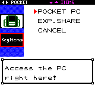

# Crystal Expansion Dev

Based on the pokecrystal disassembly by [**Pret**](https://github.com/pret/pokecrystal)

This is a work-in-progress Quality-of-Life rom hack to expand the vanilla gameplay of Pokemon crystal.

# Features

- **Pocket PC** After recieving your starter, you'll recieve a Pocket PC key item along with your potion that will give you access to the PC without being at your house or the Pokemon Center.

- **Tradeback NPC** For all trade evolutions with or without holding items a Red NPC stands in the back of Elm's Lab to trade your trade evolutions back to you.

- **Running Shoes** By holding the B button while walking, you can run.

- **Gen. 6 Exp. All Key Item** The Exp. Share is now a Key Item that can be toggled on and off to give your whole team EXP points.  You can get this item early by seeing the Elm's Aide NPC in the Ecruteak City East Gate.

- **Earn EXP by catching mons**

- **Kurt makes balls instantly** Instead of waiting until the next day.  Not sure if this'll work for the GS Ball event.

- **Restored Celebi GS Ball Event** After defeating the Elite Four and becoming Champion, go to the Goldenrod City Pokemon Center and an Aide will come up to you and hand you the GS Ball, bring it to Kurt and the next day he'll say something strange is going on in Azalea forest.  Go there, put the GS Ball in the shrine past the cut tree and you'll get to fight/catch a lvl 70 Celebi.

- **Rare Candies, Master Balls and Evolution Stones** All marts, with the exception of a couple like the fake shop in Mahogany before you fight Team Rocket, Mt. Moon and the Underground, have rare candies and master balls for sale at 0 pokedollars and evolution stones are sold on the 3rd floor of the Goldenrod City Department Store.

- **Known Issues** The dialog for the Elm's Aide NPC in the Ecruteak City East Gate isn't presenting right, but the event to get the Exp. Share works.  This will be fixed in the next update.